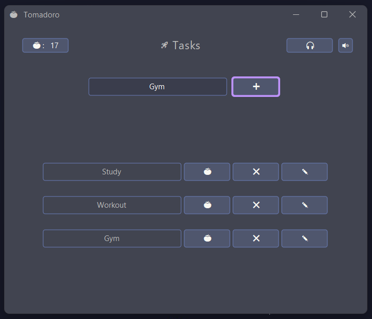
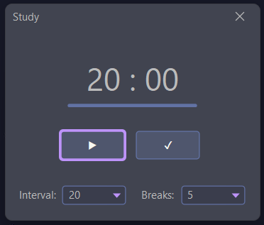
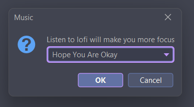

# 🍅 Tomadoro - Pomodoro-based task management app

Tomadoro is an app help students keep track of todo tasks and let them focus on studying with Pomodoro method.

## Table of contents
- [Screenshots](#screenshots)
- [Built with](#built-with)
- [Demo](#demo)
- [Author](#author)

## Screenshots






## Built with

- Java (Netbeans GUI Builder)
- [FlatLaf - Flat Look and Feel](https://www.formdev.com/flatlaf/)


## Demo

You can try the apps by downloading the repo and run this code (Java need to be installed).

```
javac -classpath ".:Tomadoro.jar:target/dependency/*"  . Achievement.java Main.java Music.java Pomodoro.java
java -classpath ".:Final.jar:target/dependency/*" Main
```

## Author

- Website - [Tien Trinh](https://tientrinh.netlify.app/)
